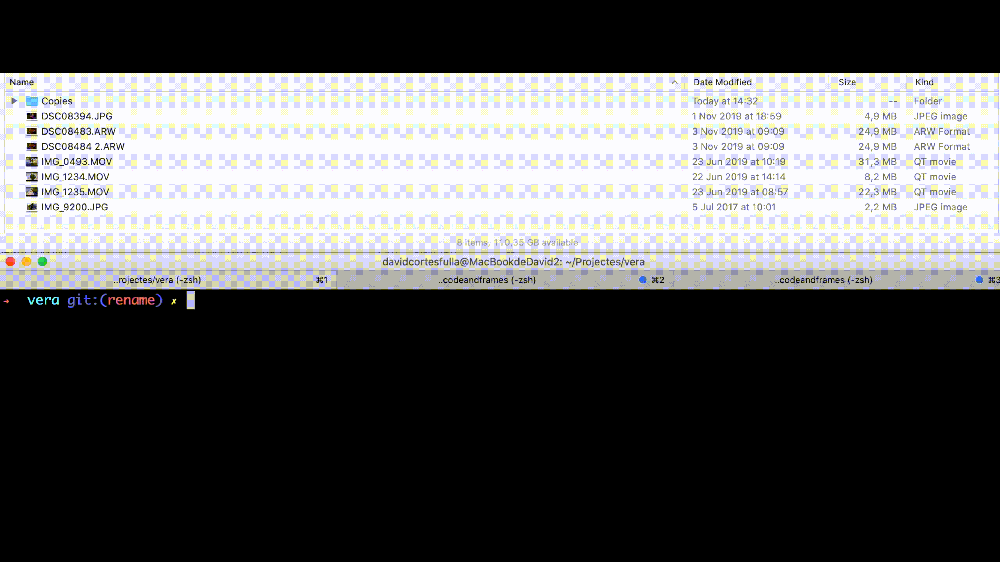

Vera is a CLI tool to manage and organize your photos and video files. I created it to automatize my current workflow for editing photos and videos. If you want to automatize yours keep reading.

## Installation

Vera requires `exiftool` to work. You can use this script to install all the dependencies and Vera all together.

```bash
bash <(curl -Ls https://git.io/JtbuH)
```

You can also install it manually before you install the gem:

```bash
brew install exiftool
gem install vera
```

Once you have it installed you can use any of the following commands.

## Available Commands

### Timestamp

This command fixes the created date and the modified date of the media files. Run the following command in the folder where you have your photos and videos:

```bash
vera timestamp --path ~/path/example
```

#### Options 

| Parameter     | Default Value     | Descripción                                            |
| ------------- | ----------------- | ------------------------------------------------------ |
| path (--path) | Current directory | Path where the command will be applied. Non-recursive. |

This command works on JPG, MOV, HEIC and ARW files.

### Rename

Prepends the creation date to the filename. This is useful to prevent having duplicate names in your files, as most cameras have a limited naming convention like IMG_0000.JPG to IMG_9999.JPG. As a result of this this command you will have file names like 2020-02-02-IMG_0000.JPG, which makes having duplicated file names almost impossible.

```bash
vera rename --path ~/path/example
```

#### Options

| Parameter     | Default Value     | Descripción                                            |
| ------------- | ----------------- | ------------------------------------------------------ |
| path (--path) | Current directory | Path where the command will be applied. Non-recursive. |

This command works on JPG, MOV, HEIC and ARW files.

#### Example



### Safe

Should I delete all this media files? Is it **safe**? This command helps you understand that. This command will find the files even if you have changed the original file name of the files. 

```bash
# Are all the media files in Folder backed up in MY_EXTERNAL_HD?
vera safe --path="Folder" --backup="/Volumes/MY_EXTERNAL_HD"
```

You can see it working here:


If you want to add more commands, feel free to contribute with a PR to Vera. In the next section I explain how to start working on it.

## Development

After checking out the repo, run `install.sh` to install dependencies. Then, run `rake spec` to run the tests.

To install this gem onto your local machine, run `bundle exec rake install`.

## Contributing

Bug reports and pull requests are welcome on GitHub at https://github.com/davebcn87/vera.

## License

The gem is available as open source under the terms of the [MIT License](https://opensource.org/licenses/MIT).
